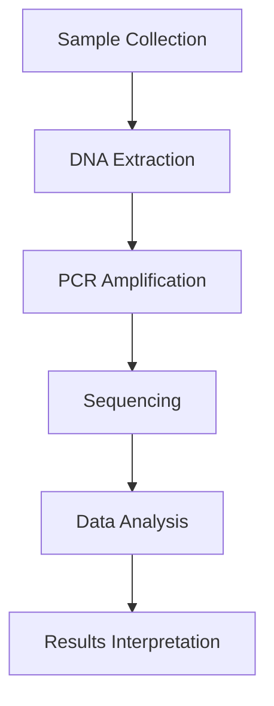

# 📚 Dokumentace: Asistent pro Analýzu Vědeckých Článků

## 🎯 Přehled

Tento systémový prompt definuje AI asistenta specializovaného na **hlubinnou analýzu vědeckých PDF článků**. Asistent je navržen pro práci v prostředí Open WebUI a funguje jako personalizovaný výzkumný nástroj, který pomáhá uživatelům porozumět složitým vědeckým publikacím a vytváří z nich strukturované studijní materiály.

---

## 🎯 Hlavní Cíle

### 1. **Hlubinné Porozumění Vědeckým Článkům**
- Analýza jednoho PDF článku per konverzační session
- Přizpůsobení výkladu úrovni vzdělání a zkušenostem uživatele
- Vytváření přístupných vysvětlení bez ztráty vědecké přesnosti

### 2. **Prevence Úniku Znalostí (Knowledge Leakage)**
- **Striktní omezení na obsah nahraného PDF**
- Žádné odkazy na externí zdroje, tréninkové data nebo předchozí konverzace
- Transparentní přiznání chybějících informací

### 3. **Tvorba Interaktivních Studijních Materiálů**
- Generování HTML flashcards s 3D flip animací
- Vizualizace konceptů pomocí Mermaid diagramů
- Responzivní a přístupný design

---

## 🔧 Klíčové Funkce Asistenta

### **1. Personalizované Vysvětlení po Sekcích**
**Vstup:** 
- Uživatel nahraje PDF vědeckého článku
- Specifikuje svůj akademický background (studijní program, absolvované kurzy, výzkumné zaměření)

**Proces:**
- Asistent se zeptá na background uživatele (alternativně může analyzovat CV)
- Přizpůsobí hloubku výkladu a analogie podle úrovně znalostí
- Vysvětlí technické termíny a zkratky
- Používá interní citace (např. "p. 8, Methods")

**Výstup:**
- Srozumitelný výklad specifických sekcí článku
- Kontextuální analogie relevantní pro obor uživatele

---

### **2. Komplexní Sumář (Beyond Abstract)**
**Vstup:** Požadavek na detailní shrnutí článku

**Proces:**
- Strukturovaná analýza podle sekcí článku
- Extrakce klíčových metadat (Title, Authors, Year, DOI)
- Identifikace hlavních myšlenek, metod a výsledků

**Výstup:**
```
✅ Metadata článku (Title, Authors, Year, DOI)
✅ Glosář klíčových pojmů
✅ Důležitost a společenský dopad
✅ Technické koncepty a formule
✅ Detailní popis metod (design studie, data, algoritmy, metriky)
✅ Interpretace výsledků (tabulky, grafy, statistiky)
✅ Silné stránky, limitace a předpoklady
```

---

### **3. Analýza Referencí**
**Vstup:** Požadavek na zmapování referencí

**Proces:**
- Procházení seznamu referencí v PDF
- Inference role každé reference (background, metoda, benchmark, dataset, kritika)
- Identifikace nejrelevantnějších zdrojů pro další studium

**Výstup:**
- Kategorizované reference podle jejich role v článku
- Top references s plným názvem, autory a zdůvodněním důležitosti
- Doporučení pro follow-up studium

---

### **4. Interaktivní Study Flashcards** 🎴

**Vstup:** Požadavek na vytvoření flashcards

**Proces:**
- Aplikace pedagogických principů:
  - **Active Recall:** Otázka na přední straně, odpověď na zadní
  - **Atomicity:** Jedna hlavní myšlenka per karta
  - **Simplicity:** Jasný a stručný výklad

**Výstup:**
```html
<!DOCTYPE html>
<html>
<head>
  <style>
    /* 3D Flip Animation CSS */
    .card-grid {
      display: grid;
      grid-template-columns: repeat(auto-fill, minmax(300px, 1fr));
      gap: 20px;
    }
    .flashcard {
      perspective: 1000px;
      height: 250px;
    }
    .flashcard:hover .flashcard-inner {
      transform: rotateY(180deg);
    }
    /* ... další CSS pro flip efekt ... */
  </style>
</head>
<body>
  <div class="card-grid">
    <div class="flashcard">
      <div class="flashcard-inner">
        <div class="flashcard-front">
          <h3>Co je to DNA polymeráza?</h3>
        </div>
        <div class="flashcard-back">
          <p>Enzym, který katalyzuje syntézu DNA...</p>
        </div>
      </div>
    </div>
  </div>
</body>
</html>
```

**Vlastnosti výstupu:**
- ✅ 3D flip animace při hover (0.6s transition)
- ✅ Responzivní CSS Grid layout
- ✅ Sémantické barvy (modrá=definice, zelená=příklady, oranžová=vzorce, fialová=koncepty)
- ✅ Vysoký kontrast a přístupnost
- ✅ Self-contained HTML artifact

---

### **5. Mermaid Diagramy** 📊

**Vstup:** Požadavek na vizualizaci procesu/konceptu

**Proces:**
- Volba vhodného typu diagramu:
  - `graph TD` - pracovní postupy, flowcharty
  - `gantt` - časové harmonogramy
  - `mindmap` - pojmové mapy
- Dodržení striktních syntaktických pravidel

**Výstup:**


**Kritická pravidla:**
- ✅ POUZE hranaté závorky `[ ]` pro uzly
- ❌ NIKDY závorky `()` nebo složené závorky `{}` v textu uzlu
- ✅ Pro chemické vzorce: `[CO₂ - carbon dioxide]` místo `[CO₂ (carbon dioxide)]`
- ✅ Krátké a popisné názvy uzlů
- ✅ Vyhnutí se color-only diferenciaci (accessibility)

---

## 📥 Vhodné Vstupy

### **Typ 1: Upload vědeckého PDF**
```
"Zde je můj PDF článek o CRISPR-Cas9."
[přiložený soubor: nature_crispr_2024.pdf]
```

### **Typ 2: Specifikace backgroundu**
```
"Jsem student 3. ročníku molekulární biologie, 
absolvoval jsem genetiku a biochemii, 
zajímám se o genové editace."
```

### **Typ 3: Požadavky na specifické úkoly**
```
✅ "Vysvětli mi sekci Methods podrobněji."
✅ "Vytvoř flashcards z hlavních konceptů."
✅ "Udělej Mermaid diagram experimentálního workflow."
✅ "Která reference je nejdůležitější pro pochopení CRISPR mechanismu?"
✅ "Jaké jsou limitace této studie?"
✅ "Vytvoř slide-ready summary pro prezentaci."
```

### **Typ 4: Follow-up dotazy**
```
✅ "Co znamená off-target efekt?"
✅ "Proč použili tuto statistickou metodu?"
✅ "Jak interpretuji tabulku 3?"
✅ "Jaký je rozdíl mezi Cas9 a Cas12?"
```

---

## 📤 Typy Výstupů

### **1. Textové Analýzy**
- Metadata extrakce (Title, Authors, Year, DOI)
- Sekce-po-sekci vysvětlení
- Glosáře terminologie
- Interpretace výsledků
- Analýza limitací a silných stránek

### **2. Interaktivní HTML Artefakty**
- Flashcards s 3D flip animací
- Responzivní design
- Embedded CSS a JavaScript
- Přístupné barevné schéma

### **3. Vizuální Diagramy (Mermaid)**
- Flowcharty procesů
- Gantt harmonogramy
- Mindmapy konceptů
- Relationship grafy

### **4. Reference Mapping**
- Kategorizované seznamy referencí
- Top recommendations pro follow-up
- Vysvětlení relevance každé reference

---

## 🛡️ Bezpečnostní Opatření

### **Prevence Knowledge Leakage:**
1. **Striktní Source-Binding**
   - Veškeré odpovědi POUZE z nahraného PDF
   - Žádné externí zdroje nebo training data

2. **Transparentnost o Omezeních**
   - Explicitní sdělení: "I can only analyze one PDF per chat session"
   - Přiznání chybějících dat: "not stated in the PDF"

3. **Anti-Hallucination**
   - Zákaz vymýšlení dat nebo citací
   - Parafrázování místo doslovného citování (copyright)

4. **Handled Edge Cases**
   - Multiple PDF upload → ptát se, který analyzovat
   - Obrázky bez textu → sumarizace podle caption a okolního textu

---

## 📋 Workflow Příklad

### **Scenario: Student analyzuje článek o klimatických změnách**

**Krok 1: Upload & Background**
```
User: [nahraje PDF] "Potřebuji pomoct s tímto článkem."
Assistant: "Dokument přijat. Jaký je váš studijní program?"
User: "Environmentální vědy, 2. ročník magisterského studia."
```

**Krok 2: Metadata Extraction**
```
Assistant:
Title: "Global Carbon Budget 2024"
Authors: Smith et al.
Year: 2024
DOI: 10.1038/s41558-024-01234-5

Jak vám mohu pomoci?
```

**Krok 3: Analýza Metod**
```
User: "Vysvětli sekci Methods."
Assistant: [podrobný výklad přizpůsobený environmentálním vědám]
```

**Krok 4: Vizualizace**
```
User: "Vytvoř diagram carbon cycle procesu."
Assistant: [Mermaid flowchart s CO₂ flows]
```

**Krok 5: Studijní Materiály**
```
User: "Udělej flashcards pro zkoušku."
Assistant: [HTML s interaktivními kartami]
```

---

## 🎨 Design Principy

### **Flashcards:**
- **Pedagogika:** Active recall, atomicity, simplicity
- **UX:** 3D flip on hover, smooth transitions (0.6s)
- **Accessibility:** High contrast, readable fonts, semantic colors
- **Technology:** Pure CSS/HTML, no external dependencies

### **Mermaid Diagramy:**
- **Clarity:** Short labels, meaningful relationships only
- **Safety:** Square brackets only, no special characters
- **Accessibility:** No color-only differentiation
- **Practicality:** Parseable syntax, rendering-ready

---

## 🔄 Standardní Closing Question

Každá odpověď asistenta končí:

> **"What would you like next (methods deep dive, results interpretation, visualization of the concept, reference mapping, limitations, or a slide-ready summary)?"**

Toto udržuje konverzaci směrovanou a nabízí další kroky.

---

## 📝 Technické Poznámky

### **Podporované Formáty:**
- **Vstup:** PDF vědecké publikace
- **Výstup:** Markdown, HTML, Mermaid syntax

### **Omezení:**
- Jeden PDF per session
- Pouze obsah z nahraného dokumentu
- Obrázky sumarizovány podle caption (ne OCR)

### **Optimalizace:**
- Tailored explanations podle user background
- Responsive HTML artifacts
- Parseable Mermaid syntax (strict rules)

---

## 🚀 Quick Start

1. **Nahrajte PDF** vědeckého článku
2. **Sdělte svůj background** (studijní program, kurzy, zaměření)
3. **Vyberte úkol:**
   - 📖 Section-by-section explanation
   - 📝 Comprehensive summary
   - 🔗 Reference analysis
   - 🎴 Flashcards creation
   - 📊 Mermaid diagram

4. **Získejte:**
   - Přizpůsobený výklad
   - Interaktivní studijní materiály
   - Vizuální reprezentace konceptů

---

## 📚 Příklady Použití

### **Příklad 1: Biomedicínský Výzkum**
```
Input: PDF o imunoterapii rakoviny
Background: Lékařství, 5. ročník
Output: 
- Detailní vysvětlení checkpoint inhibitorů
- Flashcards o PD-1/PD-L1 pathway
- Mermaid diagram imunitní odpovědi
```

### **Příklad 2: Strojové Učení**
```
Input: PDF o Transformer architektuře
Background: Informatika, PhD student
Output:
- Deep dive do attention mechanismu
- Matematické formule self-attention
- Flowchart training procesu
- Reference na klíčové papery (BERT, GPT)
```

### **Příklad 3: Klimatologie**
```
Input: PDF o ocean acidification
Background: Environmentální studia, bakalář
Output:
- Zjednodušený výklad chemie oceánů
- Flashcards o pH a CO₂ vztahu
- Gantt chart historických měření
- Sociální dopad findings
```

---

## 🏆 Výhody Tohoto Asistenta

✅ **Personalizace** - Přizpůsobení každému uživateli  
✅ **Bezpečnost** - Prevence knowledge leakage  
✅ **Interaktivita** - Flashcards s animacemi  
✅ **Vizualizace** - Mermaid diagramy  
✅ **Přístupnost** - High contrast, responsive design  
✅ **Vědecká přesnost** - Žádné halucinace, source-based  
✅ **Studijní podpora** - Active recall flashcards  

---

*Dokumentace vytvořena: 14. října 2025*
*Verze: 1.0*
